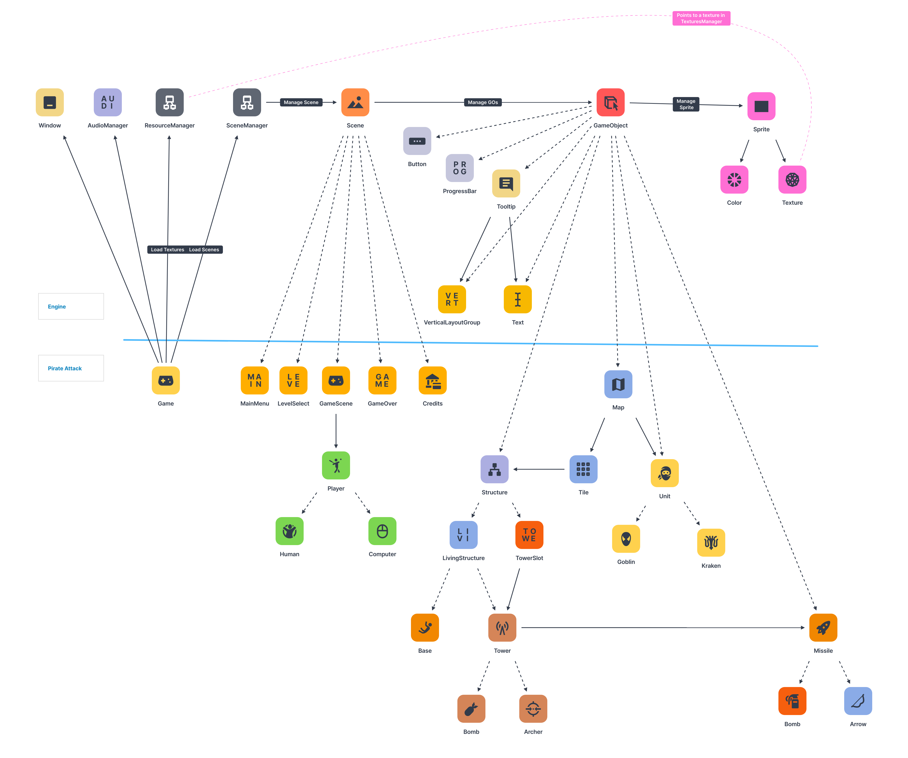

# Pirate Attack

Počítačová hra
* žánr: Tower Attack
* téma: Piráti

---

## Popis hry
### Tower Attack
Žánr Tower Attack spočívá v tom, 
že hráč pošle na nějaké určené místo na mapě své jednotky.
Ty se dle své inteligence autonomě pohybují směrem k základně nepřítele, 
kterou se pokouší zničit. Ovšem protihráč (v tomto případě PC),
se brání stavěním věží, které útočí na hráčovy jednotky.

### Pirate Attack
Ve hře Pirate Attack hráč hraje za příšery
a snaží se dobýt protihráčovo pirátské opevnění.

Hráč má na výběr 2 typy jednotek:
* Goblin (rychlý, slabý, jde rovnou po základně)
* Troll (pomalý, silný, jde po nejbližší věži / základně)

Počítač má na výběr ze 2 typů věží:
* Archer Tower (střílí šípy, které letí za jednou jednotkou, dlouhá vzdálenost, málo damage)
* Bomb Tower: Střílí bomby, které letí na poslední pozici jednotky. 
  Po dopadu vybuchne a způsobí poškození jednotkám v blízkosti.

### Průběh hry
Jedná se o velmi jednoduchý průběh hry. 

Hráč na začátku dostane omezené množství jednotek od každého druhu a nějaké peníze.
Každou sekundu se hráčovi přičte dané množství peněž. Za ty si kupuje jednotky,
které postupně pošle do boje pomocí kliknutí na vyznačené místo. 
Z tohoto místa bude jednotka vycházet. 

Protihráč za své peníze staví věže tak, aby zabránil zkáze pirátů.

### Mapa
> Implementovaná pomocí 2D pole instancí Tile

Mapa má několik vstupů pro hráče a právě jednu základnu. 
Dále má definované cesty a sloty pro stavbu věží. 
Jednotlivé mapy se dají vytvořit napsáním souboru `cislo_mapy.level` ve složce `levels`. 
Je nutné zachovat obdélníkové (příp. čtvercové) rozložení mapy. Každý řádek musí být stejně dlouhý.

Každá mapa má definici prostředků obou hráčů v souboru `cislo_mapy.xml`, který je také ve složce `levels`. 
Tj. kolik mají na začátku peněz a jaké jsou limity pro každý objekt.

#### Příklad mapy a konfigurace
##### Legenda symbolů v textové podobě mapy:
* ` `(mezera): cesta
* `#`: voda
* `@`: most
* `$`: slot
* `I`: vstup jednotek hráče
* `B`: základna pirátů
```txt
level/1.level:

9 49
#################################################
#                        #$                     I
#         #$             #           ###        #
#$        #              #     #      $#        #
B         #                    #       #        I
#$        #$                   #                #
#                              #                #
#                  $          $#                I
#################################################
```

```xml
<!-- level/1.xml -->
<level>
    <human>
        <!-- per_sec = kolik peněz dostane hráč každé 2 sekundy. -->
        <!-- start = kolik peněz dostane na začátku -->
        <money per_sec="10" start="200" />
        <units goblin="5" troll="1" />
    </human>
    <computer>
        <!-- per_sec = kolik peněz dostane hráč každé 2 sekundy. -->
        <!-- start = kolik peněz dostane na začátku -->
        <money per_sec="10" start="200" />
    </computer>
</level>
```

### AI Počítače (stavění věží)
Počítač si náhodně vybere další věž, kterou postaví. Jakmile bude mít
dostatek peněz, věž postaví na pole, kde je nejmenší číslo ochrany.
Číslo ochrany je počet věží, které na to místo dostřelí.

### AI věží (střelba)
Pokud je jednotka v radiu dostřelu věže, věž začne střílet dle její definice.

### AI Jednotek hráče (chůze)
Jednotky se samy pohybují nejlevnější cestou k pirátským stavbám.
To znamená, že chodí tou cestou, která má nejnižší stupeň ochrany. 
Jakmile jednotka dorazí k pirátské stavbě, začne ji ničit.

### Konec hry
#### Hráč vyhrál,
pokud se jednotkám podařilo zničit pirátské opevnění.

#### Hráč prohrál,
pokud mu došly jednotky a základna nebyla zničena.

## Program
Samotný program je rozdělen do dvou celků:
* Engine
* Hra

Graficky je zpracován pomocí knihovny SDL2.
  
### Diagram tříd
* plná čára: reference
* čárkovaná čára: dědičnost

